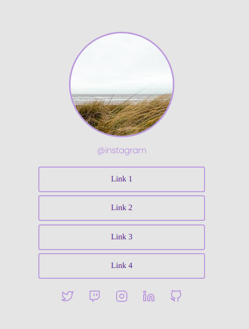

<h1 align="center">Discover Challenges</h1>

  

  

  

  

  <a href="#dart-about">About</a> &#xa0; | &#xa0;
  <a href="#rocket-technologies">Technologies</a> &#xa0; | &#xa0;
  <a href="#memo-license">License</a> &#xa0; | &#xa0;
  <a href="#heavy_check_mark-challenges">Challenges</a>

 

## :dart: About ##

Challenges proposed in the Discover course by <a href="https://github.com/Rocketseat">Rocketseat</a>.

## :rocket: Technologies ##

The following tools were used in these challenges:

- HTML
- CSS
- JavaScript

## :memo: License ##

This project is under license from MIT. For more details, see the [LICENSE](LICENSE) file.

## :heavy_check_mark: Challenges ##

<table align="center" class="tg">
  <thead>
    <tr>
      <!-- <td class="tg-0pky">Social Tree</td> -->
    </tr>
    <tbody>
      <td align="center">
       
        <a href="./social-tree/">SOCIAL TREE</a>
         
         
        
<strong>A page with a list of links (menu) that can be used on  social media profiles to direct the user to the chosen location.</strong>

        
      </td>
    </body>
  </thead>
</table>