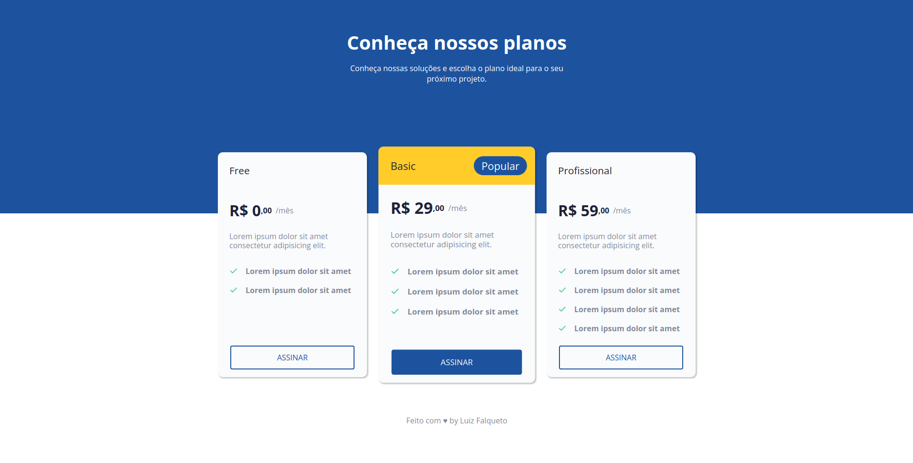

## Sidebar

 

> A page with a table with product/service pricing/plan options.

## Build with

## License
This project is under license from MIT. For more details, see the [LICENSE](https://github.com/luizgfalqueto/discover-challenges/blob/main/LICENSE) file.