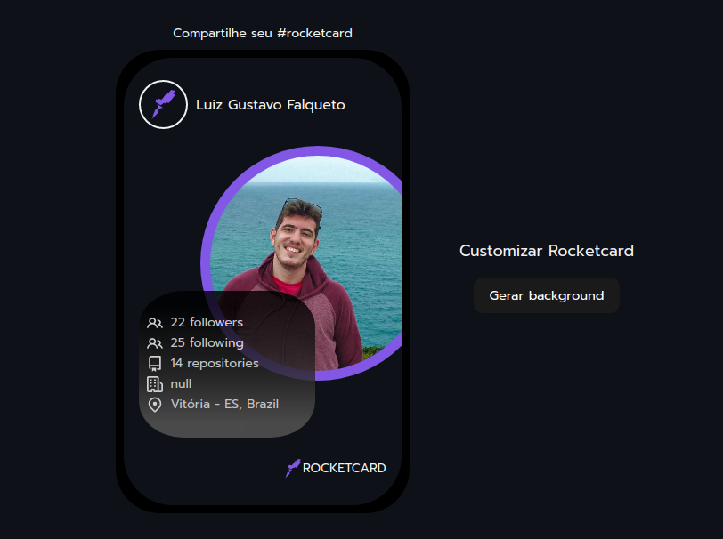

## Rocketcard

### Image Rocketcard 

 

> A card that brings information from the Github API and has a button that changes the card's background color
>
> No responsive!

## Build with

## License
This project is under license from MIT. For more details, see the [LICENSE](https://github.com/luizgfalqueto/discover-challenges/blob/main/LICENSE) file.