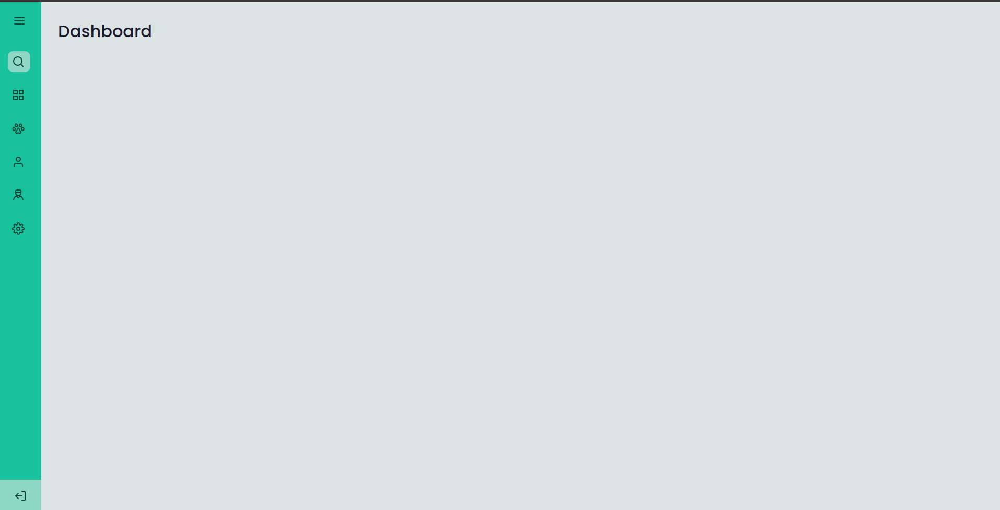
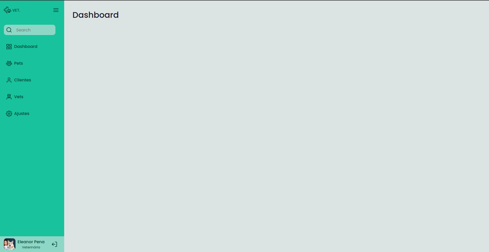

## Sidebar

 

 

> A simple sidebar with menu button to close or open the sidebar.

## Build with

## License
This project is under license from MIT. For more details, see the [LICENSE](LICENSE) file.